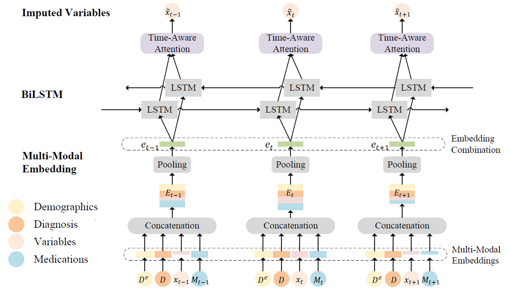
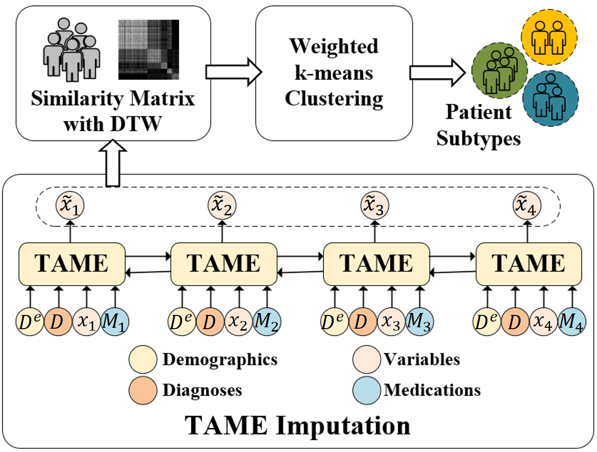
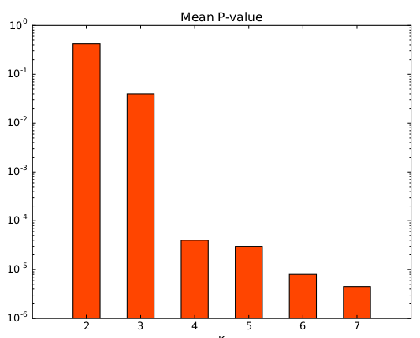
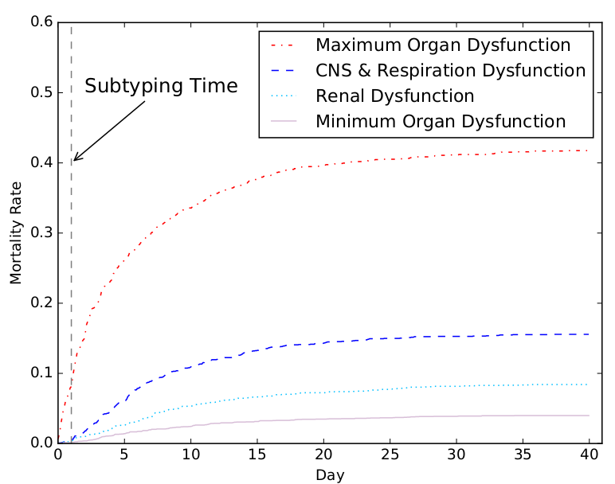
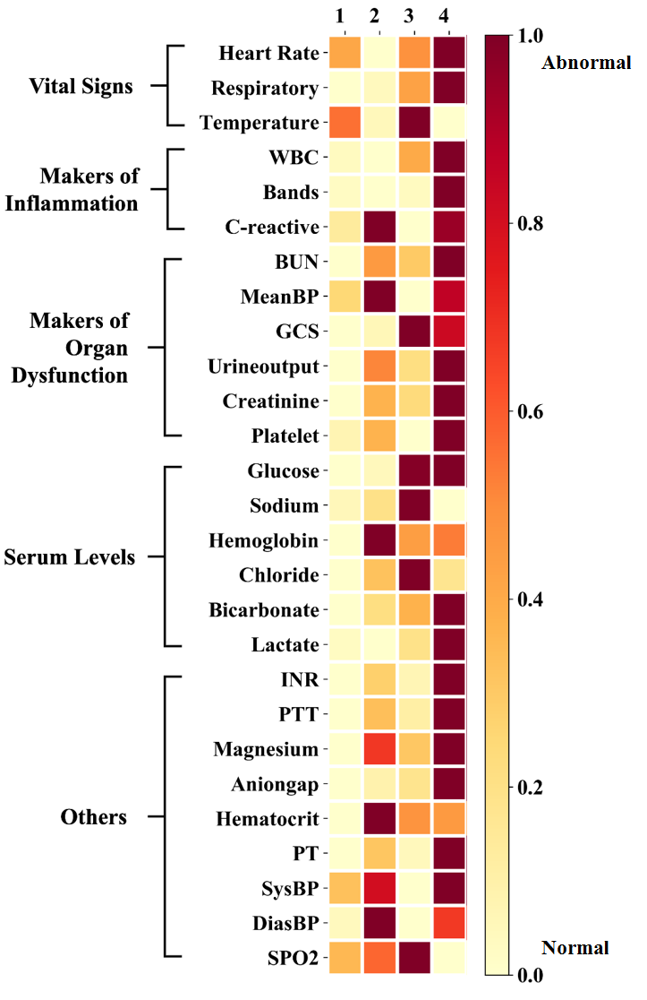

# Identifying Sepsis Subphenotypes via Time-Aware Multi-Modal Auto-Encoder

This repository contains the official PyTorch implementation of the following paper:

> **Identifying Sepsis Subphenotypes via Time-Aware Multi-ModalAuto-Encoder (KDD2020)**<br>
> Changchang yin, Ruoqi Liu, Dongdong Zhang, Ping Zhang<br>
> [paper]()
>
> **Abstract:** *Sepsis is a heterogeneous clinical syndrome that is the leading cause of mortality in hospital intensive care units (ICUs). Identification of sepsis subphenotypes may allow for more precise treatments and lead to more targeted clinical interventions. Recently, sepsis subtyping on electronic health records (EHRs) has attracted interest from healthcare researchers. However, most sepsis subtyping studies ignore the temporality of EHR data and suffer from missing values. In this paper, we propose a new sepsis subtyping framework to address the two issues. Our subtyping framework consists of a novel Time-Aware Multi-modal auto-Encoder (TAME) model which introduces time-aware attention mechanism and incorporates multi-modal inputs (e.g., demographics, diagnoses, medications, lab tests and vital signs) to impute missing values, a dynamic time wrapping (DTW) method to measure patients' temporal similarity based on the imputed EHR data, and a weighted k-means algorithm to cluster patients. Comprehensive experiments on real-world datasets show TAME outperforms the baselines on imputation accuracy. After analyzing TAME-imputed EHR data, we identify four novel subphenotypes of sepsis patients, paving the way for improved personalization of sepsis management.*

# Framework 

TAME takes multi-modal data (including demographic, diagnoses, medication, lab tests and vital signs) as inputs to impute missing values (in lab tests and vital signs).



Given the imputed data, DTW is adopted to compute temporal patient similarity. Based on the similarity matrix, wk-means is proposed to subtype sepsis patients into phenotypes.



# Files Directory
    TAME
    |
    |--code
    |
    |--file                                 * The preprocessing codes will write some files here.
    |
    |--data                                 * Put the downloaded datasets here.
    |    |
    |    |--DACMI                           * Put the downloaded DACMI dataset here.
    |    |    |
    |    |    |--train_groundtruth
    |    |    |
    |    |    |--train_with_missing
    |    |
    |    |--MIMIC
    |         |
    |         |--initial_mimiciii           * Put the downloaded MIMIC-III dataset here.
    |         |    |
    |         |    |--PATIENTS.csv
    |         |    |
    |         |    |--ICUSTAYS.csv
    |         |    |
    |         |    |--DIAGNOSES_ICD.csv
    |         |    |
    |         |    |--PRESCRIPTIONS.csv
    |         |    |
    |         |    |--LABEVENTS.csv
    |         |    |
    |         |    |--pivoted_lab.csv      * Generate pivoted_*.csv with https://github.com/MIT-LCP/mimic-code.
    |         |    |
    |         |    |--pivoted_vital.csv
    |         |    |
    |         |    |--pivoted_sofa.csv
    |         |
    |         |--train_groundtruth
    |         |
    |         |--train_with_missing
    | 
    | 
    |--result                             * The imputation results and clustering results are here.
         |
         |--DACMI
         |
         |--MIMIC

# Environment
Ubuntu16.04, python2.7

Install [pytorch 1.3.0](https://pytorch.org/)

# Data preprocessing

## DACMI data preprocessing

1. Download [DACMI](http://www.ieee-ichi.org/2019/challenge.html) dataset and put the data in TAME/data/DACMI/.

2. Preprocess DACMI data.
```
cd code/preprocessing
python generate_value_distribution.py

```

## MIMIC-III data preprocessing
1. Download [MIMIC-III](https://mimic.physionet.org) dataset and put the data in TAME/data/MIMIC/initial\_mimiciii/.

2. Generate pivoted files (pivoted\_lab.csv, pivoted\_vital.csv, pivoted\_sofa.csv) according to [MIT-LCP/mimic-code](https://github.com/MIT-LCP/mimic-code/blob/master/concepts/pivot/), and put the data in TAME/data/MIMIC/initial\_mimiciii/.

3. Preprocess MIMIC-III data.
```
cd code/preprocessing
python preprocess_mimic_data.py
python generate_sepsis_variables.py
python generate_value_distribution.py
```

# TAME

1. Train TAME model.
```
cd code/TAME
python main.py --dataset DACMI

cd code/TAME
python main.py --dataset MIMIC
```

2. Generate the imputation results.
```
cd code/TAME
python main.py --dataset DACMI --phase test --resume ../../data/DACMI/models/best.ckpt

cd code/TAME
python main.py --dataset MIMIC --phase test --resume ../../data/MIMIC/models/best.ckpt
```

## Results of TAME

The imputation results on DACMI dataset.

```
------------------------------------------------------------------------------------------------------------------------------------------------------------------------------------------------------------
Method  |     PCL     |      PK     |    PLCO2    |     PNA     |     HCT     |     HGB     |     MCV     |     PLT     |     WBC     |     RDW     |    PBUN     |    PCRE     |    PGLU     |    Mean 
------------------------------------------------------------------------------------------------------------------------------------------------------------------------------------------------------------
Mean    |    0.295    |    0.277    |    0.301    |    0.293    |    0.287    |    0.292    |    0.309    |    0.319    |    0.299    |    0.318    |    0.313    |    0.306    |    0.282    |    0.299
KNN     |    0.220    |    0.249    |    0.241    |    0.228    |    0.220    |    0.221    |    0.267    |    0.248    |    0.251    |    0.253    |    0.238    |    0.244    |    0.264    |    0.242
3DMICE  |    0.200    |    0.263    |    0.231    |    0.214    |    0.150    |    0.149    |    0.229    |    0.256    |    0.246    |    0.185    |    0.234    |    0.277    |    0.224    |    0.220
T-LGBM  |    0.135    |    0.226    |    0.179    |    0.156    |    0.100    |    0.092    |    0.229    |    0.158    |    0.199    |    0.202    |    0.134    |    0.183    |    0.240    |    0.172
------------------------------------------------------------------------------------------------------------------------------------------------------------------------------------------------------------
BRNN    |    0.155    |    0.230    |    0.196    |    0.174    |    0.090    |    0.087    |    0.245    |    0.175    |    0.211    |    0.208    |    0.154    |    0.210    |    0.252    |    0.184
CATSI   |    0.174    |    0.243    |    0.203    |    0.196    |    0.144    |    0.135    |    0.253    |    0.186    |    0.227    |    0.213    |    0.157    |    0.206    |    0.260    |    0.200
DETROIT |    0.138    |    0.219    |    0.172    |    0.155    |    0.093    |    0.087    |    0.234    |    0.152    |    0.199    |    0.201    |    0.137    |    0.181    |    0.262    |    0.172
BRITS   |    0.142    |    0.208    |    0.176    |    0.154    |    0.121    |    0.115    |    0.244    |    0.165    |    0.206    |    0.218    |    0.167    |    0.192    |    0.268    |    0.183
------------------------------------------------------------------------------------------------------------------------------------------------------------------------------------------------------------
TAME-T  |    0.102    |    0.187    |    0.144    |    0.128    |    0.079    |    0.074    |    0.227    |    0.144    |    0.199    |    0.211    |    0.128    |    0.201    |    0.228    |    0.158
TAME-V  |    0.121    |    0.193    |    0.164    |    0.145    |    0.081    |    0.076    |    0.238    |    0.168    |    0.203    |    0.201    |    0.141    |    0.210    |    0.222    |    0.166
TAME    |    0.100    |    0.179    |    0.155    |    0.125    |    0.073    |    0.077    |    0.218    |    0.136    |    0.198    |    0.180    |    0.121    |    0.185    |    0.221    |    0.151
------------------------------------------------------------------------------------------------------------------------------------------------------------------------------------------------------------
```

The imputation results on MIMIC-III dataset (all 27 variables).

```
-----------------------------------------------------------------------------------------------------------------------------------------------------------------------------------------------------------------------------------------------------------------------------------------------------------------------------------------------------------------------------------------
Model   |  aniongap  |bicarbonate | creatinine |  chloride  |  glucose   | hemoglobin |  lactate   |  platelet  |    ptt     |    inr     |     pt     |   sodium   |    bun     |    wbc     |    spo2    | C-reactive | heartrate  | hematocrit |   sysbp    |   tempc    |   diasbp   |     gcs    |  resprate  |   bands    |   meanbp   | Magnesium  |urineoutput |    Mean    
-----------------------------------------------------------------------------------------------------------------------------------------------------------------------------------------------------------------------------------------------------------------------------------------------------------------------------------------------------------------------------------------
Mean    |    0.29    |    0.24    |    0.25    |    0.22    |    0.30    |    0.27    |    0.42    |    0.27    |    0.46    |    0.32    |    0.41    |    0.24    |    0.23    |    0.26    |    0.32    |    1.37    |    0.40    |    0.31    |    0.31    |    0.38    |    0.32    |    0.37    |    0.31    |    0.86    |    0.22    |    0.42    |    0.34    |    0.37
KNN     |    0.28    |    0.22    |    0.22    |    0.22    |    0.30    |    0.25    |    0.44    |    0.26    |    0.38    |    0.31    |    0.29    |    0.24    |    0.22    |    0.25    |    0.30    |    1.31    |    0.37    |    0.28    |    0.24    |    0.37    |    0.24    |    0.38    |    0.27    |    0.80    |    0.17    |    0.41    |    0.33    |    0.34
3DMICe  |    0.22    |    0.19    |    0.22    |    0.18    |    0.27    |    0.18    |    0.42    |    0.25    |    0.40    |    0.25    |    0.29    |    0.20    |    0.22    |    0.25    |    0.27    |    1.20    |    0.34    |    0.28    |    0.24    |    0.36    |    0.20    |    0.33    |    0.27    |    0.79    |    0.15    |    0.38    |    0.30    |    0.32
-----------------------------------------------------------------------------------------------------------------------------------------------------------------------------------------------------------------------------------------------------------------------------------------------------------------------------------------------------------------------------------------
BRNN    |    0.15    |    0.17    |    0.20    |    0.13    |    0.29    |    0.12    |    0.40    |    0.20    |    0.41    |    0.16    |    0.24    |    0.18    |    0.17    |    0.26    |    0.25    |    1.28    |    0.31    |    0.25    |    0.18    |    0.26    |    0.17    |    0.23    |    0.24    |    0.96    |    0.13    |    0.36    |    0.27    |    0.30
CATSI   |    0.12    |    0.12    |    0.22    |    0.13    |    0.29    |    0.14    |    0.41    |    0.22    |    0.42    |    0.20    |    0.25    |    0.18    |    0.20    |    0.23    |    0.25    |    1.13    |    0.34    |    0.25    |    0.18    |    0.24    |    0.16    |    0.22    |    0.24    |    0.85    |    0.13    |    0.33    |    0.27    |    0.29
DETROIT |    0.11    |    0.09    |    0.28    |    0.09    |    0.27    |    0.13    |    0.38    |    0.22    |    0.46    |    0.17    |    0.24    |    0.10    |    0.17    |    0.22    |    0.26    |    1.10    |    0.31    |    0.26    |    0.18    |    0.24    |    0.16    |    0.23    |    0.24    |    0.78    |    0.13    |    0.33    |    0.25    |    0.27
BRITS   |    0.12    |    0.08    |    0.23    |    0.12    |    0.27    |    0.12    |    0.39    |    0.20    |    0.41    |    0.18    |    0.24    |    0.16    |    0.20    |    0.20    |    0.26    |    1.22    |    0.32    |    0.23    |    0.19    |    0.23    |    0.15    |    0.20    |    0.24    |    0.84    |    0.13    |    0.34    |    0.26    |    0.28
-----------------------------------------------------------------------------------------------------------------------------------------------------------------------------------------------------------------------------------------------------------------------------------------------------------------------------------------------------------------------------------------
TAME-T  |    0.13    |    0.11    |    0.24    |    0.10    |    0.25    |    0.11    |    0.34    |    0.19    |    0.36    |    0.21    |    0.24    |    0.11    |    0.17    |    0.20    |    0.24    |    1.29    |    0.24    |    0.17    |    0.15    |    0.25    |    0.13    |    0.16    |    0.23    |    0.71    |    0.12    |    0.30    |    0.24    |    0.26
TAME-V  |    0.16    |    0.13    |    0.23    |    0.12    |    0.26    |    0.11    |    0.36    |    0.20    |    0.38    |    0.19    |    0.22    |    0.14    |    0.17    |    0.20    |    0.23    |    1.29    |    0.23    |    0.18    |    0.13    |    0.21    |    0.12    |    0.15    |    0.22    |    0.70    |    0.11    |    0.31    |    0.24    |    0.26
TAME-M  |    0.13    |    0.11    |    0.24    |    0.10    |    0.25    |    0.11    |    0.34    |    0.19    |    0.36    |    0.21    |    0.24    |    0.11    |    0.17    |    0.23    |    0.24    |    1.33    |    0.24    |    0.20    |    0.14    |    0.25    |    0.14    |    0.16    |    0.24    |    0.73    |    0.14    |    0.32    |    0.25    |    0.27
TAME    |    0.11    |    0.09    |    0.19    |    0.08    |    0.26    |    0.09    |    0.35    |    0.18    |    0.38    |    0.15    |    0.20    |    0.10    |    0.14    |    0.21    |    0.22    |    1.16    |    0.23    |    0.19    |    0.13    |    0.24    |    0.12    |    0.16    |    0.20    |    0.73    |    0.12    |    0.31    |    0.23    |    0.25
-----------------------------------------------------------------------------------------------------------------------------------------------------------------------------------------------------------------------------------------------------------------------------------------------------------------------------------------------------------------------------------------
```


# DTW

Compute temporal patient similarity with DTW (on MIMIC-III dataset).
```
cd code/DTW
python main.py
```

# Weighted k-means
Cluster patients with weighted k-means (on MIMIC-III dataset).
```
cd code/wkmeans
python main.py
```

## K value selection for wieghted k-means
We conduct experiments with different K and compute the mean P-value for the variables. As is shown in the figure, K=4 is the best option (which is the elbow point).



## Results of weighted k-means


## Sepsis phenotype analysis
The ICU mortality rates in four phenotypes.



The variables' severity heatmap across the four phenotypes.



